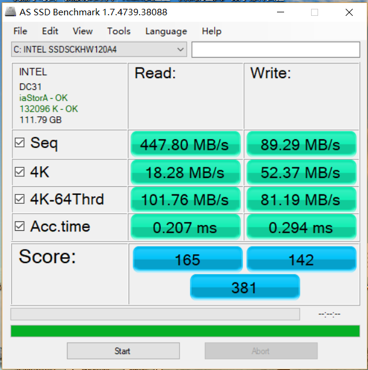
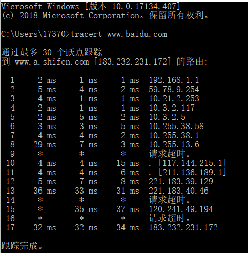
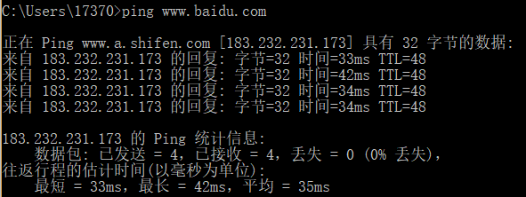
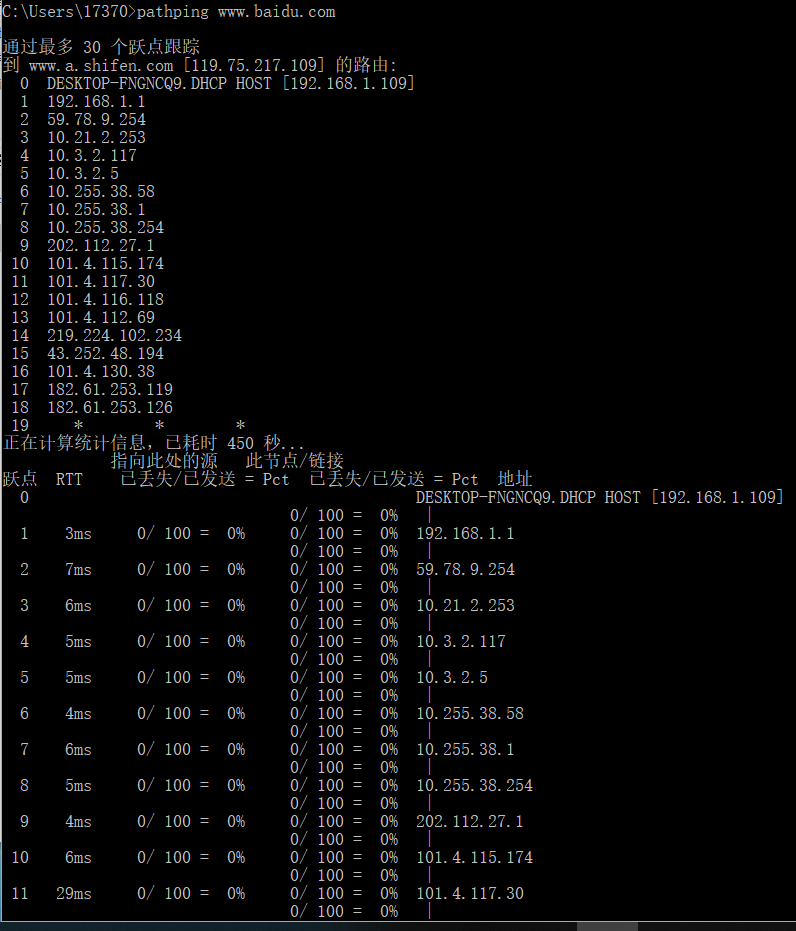
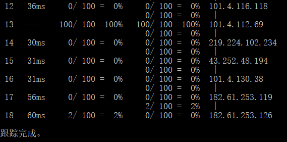

# Storage #

Storage性能的测试可以通过软件来完成

采用的软件是AS SSD Benchmark  

下图是对SSD硬盘的测试结果：  

下图是对传统硬盘的测试结果：  

在进行同样的测试时很明显就可以感觉到对传统硬盘测试时所消耗的时间比SSD长许多。  

参数含义：  

1. Seq（连续读写）：即持续测试，AS SSD会先以16MB的尺寸为单位，持续向受测分区写入，生成1个达到1GB大小的文件，然后再以同样的单位尺寸读取这个文件，最后计算出平均成绩，给出结果。测试完毕会立刻删除测试文件；  
2. 4K（4k单队列深度）：即随机单队列深度测试，测试软件以512KB的单位尺寸，生成1GB大小的测试文件，然后在其地址范围（LBA）内进行随机4KB单位尺寸进行写入和读取测试，直到跑遍这个范围为止，最后计算平均成绩给出结果。由于有生成步骤，本测试对硬盘会产生一共2GB的数据写入量，测试完毕之后文件会暂时保留；
3. 4K-64Thrd（4k 64队列深度）：即随机64队列深度测试，软件会生成64个16MB大小的测试文件（共计1GB），然后同时以4KB的单位尺寸，同时在这64个文件中进行写入和读取，最后以平均成绩为结果，产生2GB的数据写入量。测试完毕之后会立刻删除测试的文件；
4. Acc time（访问时间）：即数据存取时间测试，以4KB为单位尺寸随机读取全盘地址范围（LBA），以512B为写入单位尺寸，随机写入保留的1GB地址范围内，最后以平均成绩给出测试结果。

**从结果可以看到这块SSD硬盘的性能并不是很好，可能与其使用时间较长（已使用近三年）有关**

# Network #  

Network的性能测试可以通过ping，pathping和tracert命令来完成，也可以使用测速网站来进行简单的测试  
以下以www.baidu.com为例  

### Tracert： ###  

Tracert是一个dos下的网络命令，主要作用是对路由进行跟踪。它是一个简单的网络诊断工具，可以列出分组经过的路由节点，以及它在IP 网络中每一跳的延迟。（这里的延迟是指：分组从信息源发送到目的地所需的时间，延迟也分为许多的种类——传播延迟、传输延迟、处理延迟、排队延迟等，是大多数网站性能的瓶颈之一）  

Tracert命令是用于探索源地址到目标地址当中所经过的路线。而每到达一个点，就会向源地址返回一个信号。例如A要访问D，那么当中经过B，再经过 C。当经过B时，会向A返回一个信号，当经过C时，再向A返回一个信号，最后到达D时，返回信号，结束整个过程。在这当中需要注意的是两点，经过的节点需要有IP地址才能返回信号，像普通交换机或hub，没有IP地址，是不可能有信号返回的。二是，网络都是双向的，像上面的例子，如果我们发现 Tracert D，但到了C已经没有信号返回了，并不能说明信号到不了D，也有可能是信号到了，但中途有节点无法返回信号而已。  

Tracert（跟踪路由）是路由跟踪实用程序，用于确定 IP 数据报访问目标所采取的路径。Tracert 命令用 IP 生存时间 (TTL) 字段和 ICMP 错误消息来确定从一个主机到网络上其它主机的路由。  

通过向目标发送不同 IP 生存时间 (TTL) 值的“Internet 控制消息协议 (ICMP)”回应数据包，Tracert 诊断程序确定到目标所采取的路由。要求路径上的每个路由器在转发数据包之前至少将数据包上的 TTL 递减 1。数据包上的 TTL 减为 0 时，路由器应该将“ICMP 已超时”的消息发回源系统。  

命令执行结果的说明：  
      1. tracert命令用于确定 IP数据包访问目标所采取的路径，显示从本地到目标网站所在网络服务器的一系列网络节点的访问速度，最多支持显示30个网络节点。    
      2. 最左侧的，1，2，3，4~17，表明在我使用的宽带上，经过16（不算自己本地的）个路由节点，可以到达百度的服务；如果是其他运营商可能有不同；其他的IP，也有可能不同。   
      3. 中间的三列，单位是ms，表示我们连接到每个路由节点的速度，返回速度和多次链接反馈的平均值。    
      4. 后面的IP，就是每个路由节点对应的IP，每个IP代表什么，各位可以通过IP地址查询工具了解。  
      5. 如果返回消息是超时，则表示这个路由节点和当前我们使用的宽带，是无法联通的，至于原因，就有很多种了，比如：特意在路由上做了过滤限制，或者确实是路由的问题等，需要具体问题具体分析。  
      6. 如果在测试的时候，大量的都是*和返回超时，则就说明这个IP，在各个路由节点都有问题。  
      7. 一般10个节点以内可以完成跟踪的网站，访问速度都是不错的；10到15个节点之内才完成跟踪的网站，访问速度则比较差，如果超过30个节点都没有完成跟踪的网站，则可以认为目标网站是无法访问的。  

### Ping  ###  

ping就是对一个网址发送测试数据包，看对方网址是否有响应并统计响应时间，以此测试网络。  

### 测速网站  ###  
采用的是  www.speedtest.cn 

**速度与使用感觉有较大差异，可能是因为测试的时间（早上7点）和用户使用的高峰期（晚上20点以后）错开。**

### Pathping  ### 

pathping 命令是一个路由跟踪工具，它将 ping 和 tracert 命令的功能与这两个工具所不提供的其他信息结合起来，综合了二者的功能。pathping会先显示中间的通过的路由器（类似tracert命令得到的信息），然后对每个中间路由器（节点）发送一定数量的ping包，通过统计他们对ping包响应的数据包来分析通信质量。

**从结果可以看出来交大的网络性能比较优秀**
